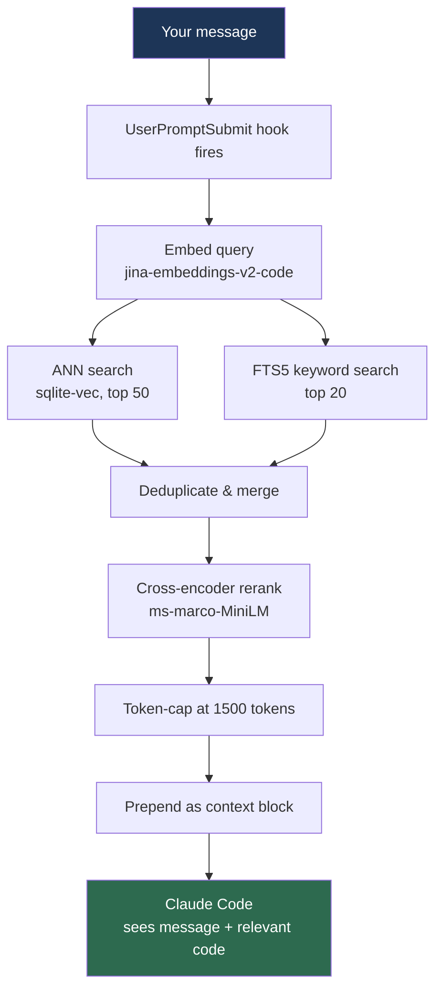

# ccindex

**Cursor-style semantic code search for Claude Code and other terminal AI agents — runs 100% on your machine.**

ccindex indexes your codebase with a local ONNX embedding model and injects the most relevant snippets into every AI message automatically via a `UserPromptSubmit` hook. No API calls. No MCP server. No cloud. No subscription.

The same two-stage retrieval Cursor uses — embed → ANN search → cross-encoder rerank — wired into your terminal agent.

```bash
pip install ccindex
ccindex update               # download 240MB of ONNX models once
ccindex index                # index your project (2-3 min first run)
ccindex install --for claude-code   # wire hook globally
claude                       # done — every message gets relevant context
```

---

## Benchmark: ccindex vs. Claude Code using tools

Measured on a real React Native + Expo project (386 files indexed). Each query run twice: once with Claude Code using its file-reading tools freely, once with ccindex context pre-injected. Five diverse queries, cold cache.

| Query | Claude tools (tokens) | ccindex (tokens) | Reduction |
|---|---:|---:|---:|
| Auth & login flow | 124,702 | 26,139 | **79% / 4.8x** |
| Workout plan creation | 109,727 | 54,177 | **51% / 2.0x** |
| Staff invitation & roles | 118,914 | 55,845 | **53% / 2.1x** |
| Subscription billing | 87,505 | 87,402 | **~0% / 1.0x** ← tie |
| Back navigation fix | 143,751 | 25,862 | **82% / 5.6x** |
| **Total** | **584,599** | **249,425** | **57% / 2.3x** |

**57% fewer input tokens → 38% lower cost → 38% lower latency** (across 5 queries: $0.611 → $0.376, 147s → 91s)

> **Honest caveat:** Query 4 (billing) was a tie — Claude had already cached those files from a previous query. The 2.3x average is measured against Claude Code *actively using tools to explore efficiently*, not against a naive "paste everything" baseline. Benchmark script: [`bench_ccindex.py`](bench_ccindex.py) — run it yourself.

Why the token gap is so large: without ccindex, Claude reads dozens of files to find what it needs, burning 80–130K tokens per question just on exploration. ccindex pre-fetches exactly the 5 most relevant chunks and injects them silently — no tool-call round trips, no exploration overhead.

---

## How it works



**Two-stage retrieval:**
- Stage 1: Approximate nearest-neighbor search over 768-dim code embeddings (fast, high recall)
- Stage 2: Cross-encoder reranking filters the candidates to the truly relevant chunks (precise, slow)

**Branch-aware indexing:** stores the current git commit hash, diffs on every query, re-embeds only changed files. Switch branches, context switches with you.

**Zero-token retrieval:** MCP-based tools spend tokens on every tool call. ccindex uses a `UserPromptSubmit` hook — context is prepended silently before the model sees your message. Retrieval costs zero tokens.

---

## Why not MCP?

MCP requires tool call round trips. Each call costs tokens (input + output) and a latency round trip. For code search this adds up fast.

ccindex injects context via hook *before* the model sees your prompt. No tool calls. No extra tokens. The model reads context the same way it reads your message — for free.

| | ccindex | MCP code search | Cursor | GitHub Copilot |
|---|:---:|:---:|:---:|:---:|
| Fully offline | ✅ | ✅ | ✅ | ❌ |
| Zero retrieval tokens | ✅ | ❌ | ✅ | N/A |
| Works in terminal agents | ✅ | ✅ | ❌ | ❌ |
| Two-stage reranking | ✅ | ❌ | ✅ | ❌ |
| Branch-aware indexing | ✅ | ❌ | ✅ | N/A |
| Hybrid vector + keyword | ✅ | varies | ✅ | N/A |

---

## Installation

```bash
pip install ccindex
# or
uv add ccindex
```

Download the ONNX models (~240MB, one-time):

```bash
ccindex update
```

Verify setup:

```bash
ccindex doctor
```

---

## Quick start

```bash
cd ~/my-project
ccindex index                           # first run: ~2-3 min
ccindex install --for claude-code       # one-time, global
claude                                  # context flows automatically
```

Every message you send in Claude Code now gets relevant code chunks prepended. No slash command, no `/ccindex`, no config per project — it just works.

---

## Agent integrations

### Claude Code

```bash
ccindex install --for claude-code
```

Installs a `UserPromptSubmit` hook in `~/.claude/settings.json` (user-level, fires globally) and registers a `/ccindex <query>` slash command for targeted manual search.

### Gemini CLI

```bash
ccindex install --for gemini-cli
```

### Antigravity

```bash
ccindex install --for antigravity
```

---

## Commands

| Command | Description |
|---|---|
| `ccindex index` | Index or re-index (incremental) |
| `ccindex query "text"` | Search manually |
| `ccindex status` | Files indexed, branch, index size |
| `ccindex doctor` | Verify models, sqlite-vec, hooks |
| `ccindex install --for <agent>` | Wire hook + slash command |
| `ccindex uninstall --for <agent>` | Remove hook and slash command |
| `ccindex install --git-hooks` | Also install post-checkout/post-merge hooks |
| `ccindex clear` | Wipe index (full rebuild next run) |
| `ccindex update` | Download latest models |
| `ccindex daemon start` | Background file watcher |

```bash
ccindex query "auth middleware" --top 10        # more results
ccindex query "retry logic" --format json       # structured output
```

---

## Configuration

`.ccindex/config.toml` in your project root (or `~/.ccindex/config.toml` globally):

```toml
[query]
top_k = 5              # chunks returned per query
token_cap = 1500       # max tokens injected per message
relevance_threshold = 0.0

[index]
max_file_size_kb = 1024
batch_size = 32

[ignore]
patterns = [
    "migrations/",
    "*.generated.ts",
    "fixtures/",
]
```

Also supports `.ccindexignore` (same syntax as `.gitignore`).

---

## What gets indexed

- **Code**: Python, JS, TS, TSX, JSX, Go, Rust, Java, C, C++, Ruby, PHP, Swift, Kotlin, Scala, Shell
- **Docs**: Markdown, RST, plain text
- **Config**: JSON, YAML, TOML, HCL, Terraform
- **Notebooks**: `.ipynb` (each cell as a chunk)

**Automatically skipped:**
- `node_modules/`, `.venv/`, `dist/`, `build/`, `__pycache__/`, `Pods/`, `.gradle/`
- Lock files: `package-lock.json`, `yarn.lock`, `uv.lock`, etc.
- Secret files: `.env*`, `*.pem`, `*.key`, `google-services.json`, `*-adminsdk-*.json`, `credentials.json`, `client_secret.json`, and other credential patterns
- Minified/generated: `*.min.js`, `*_pb2.py`, `*.generated.ts`
- Binary files (detected by content)
- `.gitignore`'d paths
- Files over 1MB

---

## Models

| Model | Size | Purpose |
|---|---|---|
| `jinaai/jina-embeddings-v2-base-code` (INT8) | 154 MB | Code embeddings — 768-dim, trained on code |
| `cross-encoder/ms-marco-MiniLM-L-6-v2` | 86 MB | Reranking — filters ANN candidates by true relevance |

Both run locally via ONNX Runtime (CPU). No GPU required. A full query takes ~200ms on an M-series Mac. First-run indexing: ~2-3 minutes for a 400-file project.

---

## Index storage

Index lives at `<project-root>/.ccindex/index.db` — per-project, isolated, auto-added to `.gitignore`. Models at `~/.ccindex/models/` (downloaded via `ccindex update`).

---

## Development

```bash
git clone https://github.com/dillibabukadati/ccindex
cd ccindex
uv sync
pytest
ccindex index
ccindex query "how does the reranker work"
```

---

## License

MIT
